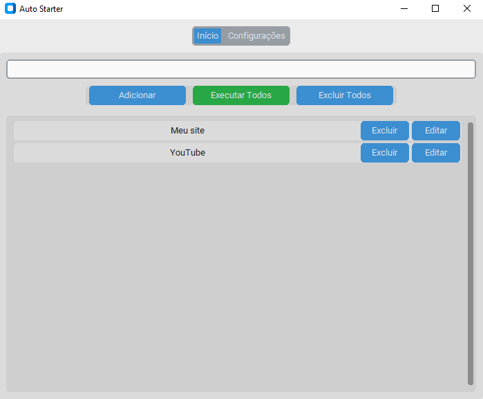
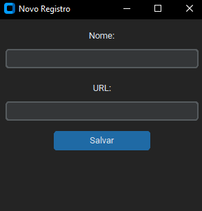
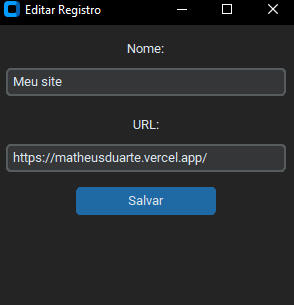
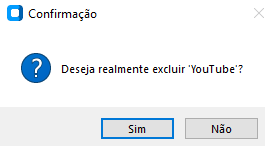

# 🚀 Auto Starter GUI

Aplicativo com interface gráfica feito em Python, que permite cadastrar sites personalizados para abrir com um clique. Ideal para quem deseja automatizar o início das tarefas diárias no PC, como abrir o e-mail, YouTube, ou qualquer URL específica.

---

### ✅ O que o Auto Starter faz?

- Permite **cadastrar sites** com nomes personalizados
- Executa todos os sites com 1 clique
- Permite editar, excluir e pesquisar sites da lista
- Possui **modo claro/escuro**
- Interface moderna e leve.

---

### 📦 Como rodar o projeto localmente?

#### 1. Clone o repositório

- git clone https://github.com/MatheusDLins/Auto_Starter.git
- cd Auto_Starter

#### 2. Crie um ambiente virtual (opcional)

- python -m venv venv
- venv\\Scripts\\activate    (Windows)


#### 3. Instale as dependências

- pip install -r requirements.txt


#### 4. Execute o app

- python main.py


### 📁 Estrutura do projeto

```bash
Auto_Starter/
├── main.py                 # Arquivo principal
├── config.json             # Configurações salvas e sites/programas cadastrados (gerado em tempo de execução)
├── interface/
│   └── app.py              # Interface com CustomTkinter
└── README.md


### 🖥️ Interface do programa e como usar:

#### 🔍 Pesquisa rápida

Use o campo **"Buscar site..."** na parte superior da tela para localizar rapidamente sites e aplicações pelo nome.

![Busca]!(img/busca.png)

---

#### 🏠 Tela Inicial

A tela principal exibe a lista de sites cadastrados, com os botões:

- ➕ Adicionar Site
- ▶️ Executar Todos
- 🗑️ Excluir Todos



---

#### ⚙️ Configurações (Modo Claro/Escuro)

Clique na aba **"Configurações"** e escolha entre:

- Light (claro)
- Dark (escuro)
- System (tema do sistema)

A preferência será salva automaticamente.


---

#### ➕ Cadastrar um novo site ou programa

1. Clique em **Adicionar Site**
2. Digite o **nome** que desejar (ex: Google)
3. Cole a **URL** (ex: https://www.google.com)
4. Clique em **Salvar**



---

#### ✏️ Editar um site ou programa

1. Clique no botão **Editar** ao lado do item
2. Altere nome e/ou URL
3. Clique em **Salvar**



---

#### 🗑️ Excluir um site ou programa

1. Clique em **Excluir** ao lado do item desejado
2. Confirme a ação na janela de confirmação



---

#### 🚫 Excluir todos os sites ou programas

Clique em **Excluir Todos** e confirme. Isso removerá **todos os registros** da lista.

⚠️ Essa ação é irreversível.

---

#### ▶️ Executar todos os sites e programa

Clicando em **Executar Todos**, o app abrirá automaticamente todos os sites cadastrados no seu navegador padrão.


---